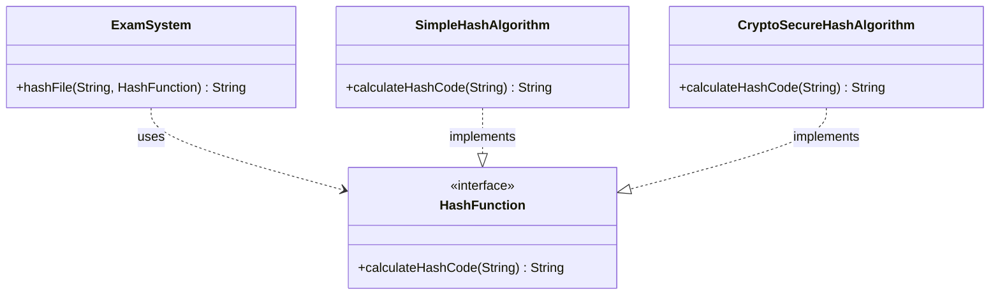
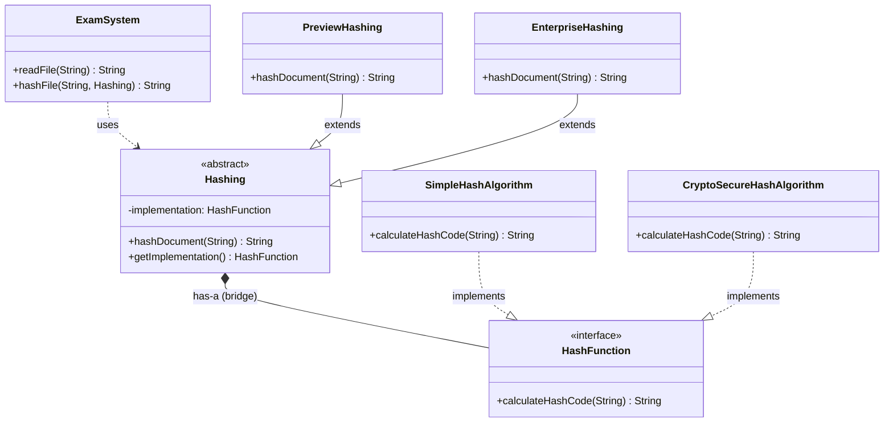

# Bridge Pattern Implementation Guide

## Overview

The **Bridge Pattern** is a structural design pattern that decouples an abstraction from its implementation so that the two can vary independently. This guide walks through refactoring an exam hashing system to use the Bridge Pattern.

---

## Problem Statement

The existing system has `ExamSystem` directly using `HashFunction` implementations (`SimpleHashAlgorithm` and `CryptoSecureHashAlgorithm`). The goal is to introduce a **bridge** (`Hashing` abstraction) that allows:
- **PreviewHashing**: Free version with limitations (uses `SimpleHashAlgorithm`)
- **EnterpriseHashing**: Full version (uses `CryptoSecureHashAlgorithm`)

---

## UML Diagrams

### Before: Original Design



### After: Bridge Pattern Design



**Key Relationships:**
- `ExamSystem` uses `Hashing` (abstraction)
- `Hashing` has-a `HashFunction` (the bridge to implementation)
- `PreviewHashing` extends `Hashing` and uses `SimpleHashAlgorithm`
- `EnterpriseHashing` extends `Hashing` and uses `CryptoSecureHashAlgorithm`

---

## Task Breakdown

---

### Task 1: Implement `Hashing` Abstract Class (3 of 3 tests passing)

**Objective**: Create a new abstract class `Hashing` that serves as the "bridge" abstraction, holding a reference to a `HashFunction` implementation.

**Requirements:**
- Private field `implementation` of type `HashFunction`
- Constructor accepting `HashFunction` parameter
- Getter method `getImplementation()`
- Abstract method `hashDocument(String)`

#### Step 1.1: Create the file

Create new file: `src/de/tum/cit/aet/pse/Hashing.java`

#### Step 1.2: Add the class implementation

*File did not exist before*

```diff
+ package de.tum.cit.aet.pse;
+ 
+ public abstract class Hashing 
+ {
+     private HashFunction implementation;
+ 
+     public Hashing(HashFunction hashFunction)
+     {
+         this.implementation = hashFunction;
+     }
+ 
+     public HashFunction getImplementation() {
+         return implementation;
+     }
+ 
+     public abstract String hashDocument(String document);
+ }
```

---

### Task 2: Implement `PreviewHashing` (4 of 4 tests passing)

**Objective**: Create a subclass of `Hashing` that:
- Uses `SimpleHashAlgorithm` as its implementation
- Throws `IllegalArgumentException` if document exceeds 1000 characters

**Requirements:**
- Extend `Hashing`
- Constant for maximum length: 1000
- Call `super(new SimpleHashAlgorithm())` in constructor
- Override `hashDocument()` with length validation

#### Step 2.1: Create the file

Create new file: `src/de/tum/cit/aet/pse/PreviewHashing.java`

#### Step 2.2: Add the class implementation

*File did not exist before*

```diff
+ package de.tum.cit.aet.pse;
+ 
+ public class PreviewHashing extends Hashing {
+     private static final int PREVIEW_HASH_MAXIMUM_LENGTH = 1000;
+     
+     public PreviewHashing() {
+         super(new SimpleHashAlgorithm());
+     }
+ 
+     @Override
+     public String hashDocument(String document) {
+         if (document.length() <= PREVIEW_HASH_MAXIMUM_LENGTH)
+             return getImplementation().calculateHashCode(document);
+         else
+             throw new IllegalArgumentException("Document too long for Preview Hashing");
+     }
+ }
```

---

### Task 3: Implement `EnterpriseHashing` (3 of 3 tests passing)

**Objective**: Create a subclass of `Hashing` that:
- Uses `CryptoSecureHashAlgorithm` as its implementation
- Has no document length restrictions

**Requirements:**
- Extend `Hashing`
- Call `super(new CryptoSecureHashAlgorithm())` in constructor
- Override `hashDocument()` without restrictions

#### Step 3.1: Create the file

Create new file: `src/de/tum/cit/aet/pse/EnterpriseHashing.java`

#### Step 3.2: Add the class implementation

*File did not exist before*

```diff
+ package de.tum.cit.aet.pse;
+ 
+ public class EnterpriseHashing extends Hashing {
+     public EnterpriseHashing() {
+         super(new CryptoSecureHashAlgorithm());
+     }
+ 
+     @Override
+     public String hashDocument(String document) {
+         return getImplementation().calculateHashCode(document);
+     }
+ }
```

---

### Task 4: Implement `readFile` in `ExamSystem` (1 of 1 tests passing)

**Objective**: Implement file reading functionality that:
- Reads file content and returns it as a String
- Catches exceptions and throws `RuntimeException` with descriptive message

**Requirements:**
- Use `java.nio.file.Files.readString()` 
- Wrap in try-catch for `IOException`
- Throw `RuntimeException` with descriptive error message

#### Step 4.1: Add required imports

```diff
  package de.tum.cit.aet.pse;

+ import java.nio.file.Files;
  import java.nio.file.Path;
+ import java.io.IOException;

  public final class ExamSystem {
```

#### Step 4.2: Implement the `readFile` method

```diff
  public static String readFile(String filepath) {
      Path path = Path.of(filepath);
      // TODO 4: Return the content of the passed file as a String.
-     return null;
+     try {
+         String content = Files.readString(path);
+         return content;
+     } catch (IOException e) {
+         throw new RuntimeException("Error reading file: " + filepath, e);
+     }
  }
```

---

### Task 5: Adapt `hashFile` in `ExamSystem` (2 of 2 tests passing)

**Objective**: Change method signature to accept `Hashing` instead of `HashFunction`

**Requirements:**
- Change parameter type from `HashFunction` to `Hashing`
- Call `hashDocument()` instead of `calculateHashCode()`

#### Step 5.1: Modify the method signature and body

```diff
  // TODO 5: Change signature, make use of the bridge pattern
- public static String hashFile(String document, HashFunction hashFunction) {
-     return hashFunction.calculateHashCode(document);
+ public static String hashFile(String document, Hashing hashing) {
+     return hashing.hashDocument(document);
  }
```

---

### Task 6: Adapt `main` method in `ExamSystem` (1 of 1 tests passing)

**Objective**: Update main method to use `PreviewHashing` and `EnterpriseHashing` instead of direct `HashFunction` implementations

**Requirements:**
- Replace `HashFunction simpleHash = new SimpleHashAlgorithm()` with `Hashing previewHashing = new PreviewHashing()`
- Replace `HashFunction cryptoSecureHash = new CryptoSecureHashAlgorithm()` with `Hashing enterpriseHashing = new EnterpriseHashing()`
- Update all method calls with new variable names

#### Step 6.1: Replace SimpleHashAlgorithm with PreviewHashing

```diff
  // TODO 6: Change SimpleHash to PreviewHashing
- HashFunction simpleHash = new SimpleHashAlgorithm();
+ Hashing previewHashing = new PreviewHashing();

- System.out.println(hashFile(file1, simpleHash));
+ System.out.println(hashFile(file1, previewHashing));
  try {
-     System.out.println(hashFile(file2, simpleHash));
+     System.out.println(hashFile(file2, previewHashing));
      throw new IllegalStateException("Hashing this file with preview hashing should not work!");
  } catch (IllegalArgumentException e) {
      e.printStackTrace();
  }
```

#### Step 6.2: Replace CryptoSecureHashAlgorithm with EnterpriseHashing

```diff
  // TODO 6: Change CryptoSecureHashAlgorithm to EnterpriseHashing
- HashFunction cryptoSecureHash = new CryptoSecureHashAlgorithm();
+ Hashing enterpriseHashing = new EnterpriseHashing();

- System.out.println(hashFile(file1, cryptoSecureHash));
- System.out.println(hashFile(file2, cryptoSecureHash));
+ System.out.println(hashFile(file1, enterpriseHashing));
+ System.out.println(hashFile(file2, enterpriseHashing));
```

---

## Complete File Changes Summary

### New Files Created

| File | Purpose |
|------|---------|
| `Hashing.java` | Abstract bridge class |
| `PreviewHashing.java` | Limited preview version (SimpleHashAlgorithm) |
| `EnterpriseHashing.java` | Full enterprise version (CryptoSecureHashAlgorithm) |

### Modified Files

| File | Changes |
|------|---------|
| `ExamSystem.java` | Added imports, implemented `readFile()`, modified `hashFile()` signature, updated `main()` |

### Unchanged Files

| File | Status |
|------|--------|
| `HashFunction.java` | No changes required |
| `SimpleHashAlgorithm.java` | No changes required |
| `CryptoSecureHashAlgorithm.java` | No changes required |

---

## Test Data

| File | Characters | Can be hashed by |
|------|------------|------------------|
| `short_exam.txt` | 65 | PreviewHashing ✓, EnterpriseHashing ✓ |
| `long_exam.txt` | 1814 | PreviewHashing ✗ (>1000), EnterpriseHashing ✓ |

---

## Bridge Pattern Benefits in This Implementation

1. **Decoupling**: The `Hashing` abstraction is decoupled from `HashFunction` implementations
2. **Extensibility**: New hashing versions (like `PremiumHashing`) can be added without modifying existing code
3. **Single Responsibility**: Each class has a clear, single purpose
4. **Easy Algorithm Switching**: Algorithms can be swapped at runtime via constructor injection
5. **Testing**: Each component can be tested independently

---

## Git Commit History

```
beb0997 fixed warning
22bbfac try to fix main again
0d32a6e try to fix main
8312e3e try fix again
35bbe0f try to pass test
d2915c1 fixed error throwing
723d664 fixed implementation
c79a845 fixed error
53e64ea done
cd04a0b Set up template for exercise  ← Initial template
```

---

## Quick Reference: Key Pattern Elements

| Bridge Pattern Element | Implementation in This Project |
|------------------------|--------------------------------|
| **Abstraction** | `Hashing` (abstract class) |
| **Refined Abstraction** | `PreviewHashing`, `EnterpriseHashing` |
| **Implementor** | `HashFunction` (interface) |
| **Concrete Implementor** | `SimpleHashAlgorithm`, `CryptoSecureHashAlgorithm` |
| **Client** | `ExamSystem` |
