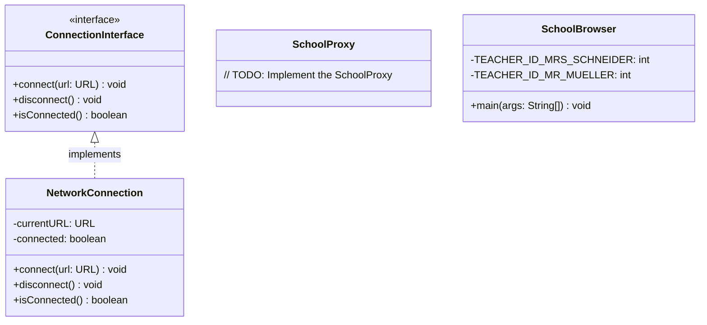
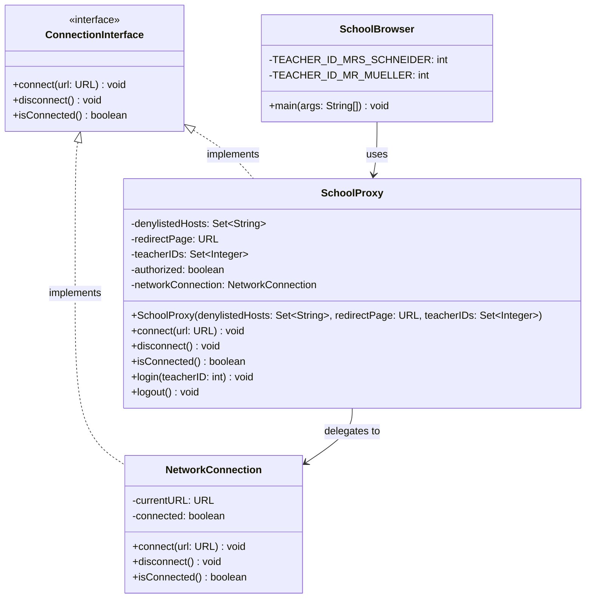

# Proxy Pattern Exercise Guide

## Problem Statement

The **Friedrich-Schiller-Exzellenz School** wants to implement a pupil-friendly `SchoolBrowser`. It restricts students from accessing inappropriate websites, which are specified beforehand. You want to apply the **Proxy Pattern** to separate functionality from access control.

The Proxy Pattern is a structural design pattern that lets you provide a substitute or placeholder for another object. A proxy controls access to the original object, allowing you to perform something either before or after the request gets through to the original object.

---

## UML Class Diagram

### Before (Template State)



### After (Completed State)



---

## Tasks Overview

| Task | Description | Tests |
|------|-------------|-------|
| 1 | Implement `ConnectionInterface` in `SchoolProxy` | 2 of 2 |
| 2 | Implement constructor in `SchoolProxy` | 3 of 3 |
| 3 | Delegate to `NetworkConnection` | 3 of 3 |
| 4 | Check for denylisted hosts before connecting | 1 of 1 |
| 5 | SchoolProxy authorization | 4 of 4 |

---

## Task 1: Implement ConnectionInterface in SchoolProxy

**Goal:** The `SchoolProxy` class needs to implement the `ConnectionInterface`. Make sure to introduce all method stubs according to the UML diagram.

### Before
```java
  package de.tum.cit.aet.pse;
  
- public class SchoolProxy {
+ public class SchoolProxy implements ConnectionInterface {
  
          // TODO: Implement the SchoolProxy
  
  }
```

### After
```java
package de.tum.cit.aet.pse;

import java.net.URL;
import java.util.Set;

public class SchoolProxy implements ConnectionInterface {

    // TODO: Implement the SchoolProxy

    @Override
    public void connect(URL url) {
        // To be implemented
    }

    @Override
    public void disconnect() {
        // To be implemented
    }

    @Override
    public boolean isConnected() {
        // To be implemented
        return false;
    }
}
```

---

## Task 2: Implement a Constructor in SchoolProxy

**Goal:** Implement the constructor of `SchoolProxy` according to the UML diagram. The constructor creates a new instance of `NetworkConnection` and assigns it to the attribute `networkConnection` of `SchoolProxy`. Also, set `authorized` to `false` since users aren't authorized by default.

### Before
```java
  package de.tum.cit.aet.pse;
  
+ import java.net.URL;
+ import java.util.Set;
+ 
  public class SchoolProxy implements ConnectionInterface {
+     private Set<String> denylistedHosts;
+     private URL redirectPage;
+     private Set<Integer> teacherIDs;
+     private boolean authorized;
+     private NetworkConnection networkConnection;
  
-     // TODO: Implement the SchoolProxy
+     public SchoolProxy(Set<String> denylistedHosts, URL redirectPage, Set<Integer> teacherIDs) {
+         this.denylistedHosts = denylistedHosts;
+         this.redirectPage = redirectPage;
+         this.teacherIDs = teacherIDs;
+         this.authorized = false;
+         this.networkConnection = new NetworkConnection();
+     }
  
  }
```

### After
```java
package de.tum.cit.aet.pse;

import java.net.URL;
import java.util.Set;

public class SchoolProxy implements ConnectionInterface {
    private Set<String> denylistedHosts;
    private URL redirectPage;
    private Set<Integer> teacherIDs;
    private boolean authorized;
    private NetworkConnection networkConnection;

    public SchoolProxy(Set<String> denylistedHosts, URL redirectPage, Set<Integer> teacherIDs) {
        this.denylistedHosts = denylistedHosts;
        this.redirectPage = redirectPage;
        this.teacherIDs = teacherIDs;
        this.authorized = false;
        this.networkConnection = new NetworkConnection();
    }

    // ... method stubs
}
```

---

## Task 3: Delegate to NetworkConnection

**Goal:** The `SchoolProxy` delegates the method calls specified in `ConnectionInterface` to `NetworkConnection`.

### Before
```java
      @Override
      public void connect(URL url) {
-         // To be implemented
+         networkConnection.connect(url);
      }
  
      @Override
      public void disconnect() {
-         // To be implemented
+         networkConnection.disconnect();
      }
  
      @Override
      public boolean isConnected() {
-         // To be implemented
-         return false;
+         return networkConnection.isConnected();
      }
```

### After
```java
@Override
public void connect(URL url) {
    networkConnection.connect(url);
}

@Override
public void disconnect() {
    networkConnection.disconnect();
}

@Override
public boolean isConnected() {
    return networkConnection.isConnected();
}
```

---

## Task 4: Check for Denylisted Hosts Before Connecting

**Goal:** Only connections to URLs that do not include hosts specified in `denylistedHosts` succeed in the `connect(...)` method of `SchoolProxy`. In the case of failure, print a descriptive message to `System.err` that shows which requested URL was rejected.

### Before
```java
      @Override
      public void connect(URL url) {
+         if (denylistedHosts.contains(url.getHost())) {
+             System.err.println("Connection to '" + url + "' was rejected!");
+             return;
+         }
          networkConnection.connect(url);
      }
```

### After
```java
@Override
public void connect(URL url) {
    if (denylistedHosts.contains(url.getHost())) {
        System.err.println("Connection to '" + url + "' was rejected!");
        return;
    }
    networkConnection.connect(url);
}
```

---

## Task 5: SchoolProxy Authorization

**Goal:** 
1. Allow teachers to authenticate themselves with `login(teacherID: int)`. If authenticated, set `authorized` to `true`, and requested URLs are not restricted anymore.
2. Allow logout with `logout()`, setting `authorized` back to `false`.
3. Redirect calls of the `connect(...)` method for denylisted hosts to the redirect page if not authorized, by providing a descriptive message including the `redirectPage` on `System.out`.

### Before
```java
      @Override
      public void connect(URL url) {
-         if (denylistedHosts.contains(url.getHost())) {
+         if (!authorized && denylistedHosts.contains(url.getHost())) {
              System.err.println("Connection to '" + url + "' was rejected!");
-             return;
+             System.out.println("Redirecting to " + redirectPage);
+             url = redirectPage;
          }
          networkConnection.connect(url);
      }
  
      // ... existing methods ...
  
+     public void login(int teacherID) {
+         if (teacherIDs.contains(teacherID)) {
+             authorized = true;
+             System.out.println("Login successful for teacher ID: " + teacherID);
+         } else {
+             System.err.println("Login failed for teacher ID: " + teacherID);
+         }
+     }
+ 
+     public void logout() {
+         authorized = false;
+         System.out.println("Logged out successfully.");
+     }
```

### After
```java
@Override
public void connect(URL url) {
    if (!authorized && denylistedHosts.contains(url.getHost())) {
        System.err.println("Connection to " + url + " was rejected.");
        System.out.println("Redirecting to " + redirectPage);
        url = redirectPage;
    }
    networkConnection.connect(url);
}

public void login(int teacherID) {
    if (teacherIDs.contains(teacherID)) {
        authorized = true;
        System.out.println("Login successful for teacher ID: " + teacherID);
    } else {
        System.err.println("Login failed for teacher ID: " + teacherID);
    }
}

public void logout() {
    authorized = false;
    System.out.println("Logged out successfully.");
}
```

---

## Complete Solution: SchoolProxy.java

### Full Diff (Before → After)

```diff
  package de.tum.cit.aet.pse;
  
- public class SchoolProxy {
+ import java.net.URL;
+ import java.util.Set;
+ 
+ public class SchoolProxy implements ConnectionInterface {
+     private Set<String> denylistedHosts;
+     private URL redirectPage;
+     private Set<Integer> teacherIDs;
+     private boolean authorized;
+     private NetworkConnection networkConnection;
+ 
+     public SchoolProxy(Set<String> denylistedHosts, URL redirectPage, Set<Integer> teacherIDs) {
+         this.denylistedHosts = denylistedHosts;
+         this.redirectPage = redirectPage;
+         this.teacherIDs = teacherIDs;
+         this.authorized = false;
+         this.networkConnection = new NetworkConnection();
+     }
  
-         // TODO: Implement the SchoolProxy
+     @Override
+     public void connect(URL url) {
+         if (!authorized && denylistedHosts.contains(url.getHost())) {
+             System.err.println("Connection to " + url + " was rejected.");
+             System.out.println("Redirecting to " + redirectPage);
+             url = redirectPage;
+         }
+         networkConnection.connect(url);
+     }
+ 
+     @Override
+     public void disconnect() {
+         networkConnection.disconnect();
+     }
+ 
+     @Override
+     public boolean isConnected() {
+         return networkConnection.isConnected();
+     }
+ 
+     public void login(int teacherID) {
+         if (teacherIDs.contains(teacherID)) {
+             authorized = true;
+             System.out.println("Login successful for teacher ID: " + teacherID);
+         } else {
+             System.err.println("Login failed for teacher ID: " + teacherID);
+         }
+     }
+ 
+     public void logout() {
+         authorized = false;
+         System.out.println("Logged out successfully.");
+     }
  }
```

---

## SchoolBrowser.java Changes

To test the proxy, uncomment the code in `SchoolBrowser`:

```diff
          URL redirectPage = URI.create("https://www.exzellenz.tum.de/startseite/").toURL();
          System.out.println("Redirect page configured: " + redirectPage);
  
-         /*
          SchoolProxy schoolProxy = new SchoolProxy(denylistedHosts, redirectPage, teacherIDs);
  
          schoolProxy.connect(URI.create("https://www.google.com/search?q=pinguine").toURL());
          schoolProxy.disconnect();
  
          // this page is not allowed for students
          schoolProxy.connect(URI.create("https://www.instagram.com/tu.muenchen").toURL());
          schoolProxy.disconnect();
  
          // authorize as teacher in order to access pages of denylisted hosts
          schoolProxy.login(TEACHER_ID_MRS_SCHNEIDER);
          schoolProxy.connect(URI.create("https://www.instagram.com/tu.muenchen").toURL());
          schoolProxy.disconnect();
-         */
      }
```

---

## Expected Output

When running `SchoolBrowser.main()`:

```
The SchoolBrowser does not allow connections to the following hosts: [www.facebook.com, www.instagram.com, www.reddit.com]
Authorized teacher IDs: [934543895, 37984283]
Redirect page configured: https://www.exzellenz.tum.de/startseite/
You connected to https://www.google.com/search?q=pinguine
You disconnected from https://www.google.com/search?q=pinguine
Connection to https://www.instagram.com/tu.muenchen was rejected.
Redirecting to https://www.exzellenz.tum.de/startseite/
You connected to https://www.exzellenz.tum.de/startseite/
You disconnected from https://www.exzellenz.tum.de/startseite/
Login successful for teacher ID: 934543895
You connected to https://www.instagram.com/tu.muenchen
You disconnected from https://www.instagram.com/tu.muenchen
```

---

## Key Concepts

### Proxy Pattern Components

| Component | Class | Description |
|-----------|-------|-------------|
| **Subject** | `ConnectionInterface` | The common interface for both RealSubject and Proxy |
| **RealSubject** | `NetworkConnection` | The real object that the proxy represents |
| **Proxy** | `SchoolProxy` | Controls access to the RealSubject |
| **Client** | `SchoolBrowser` | Works with subjects through the Subject interface |

### Benefits of Using Proxy Pattern Here

1. **Access Control**: Students are restricted from accessing denylisted websites
2. **Separation of Concerns**: Connection logic is separated from access control logic
3. **Lazy Initialization**: `NetworkConnection` is only created when `SchoolProxy` is instantiated
4. **Transparent to Client**: `SchoolBrowser` can use `SchoolProxy` just like it would use `NetworkConnection`
