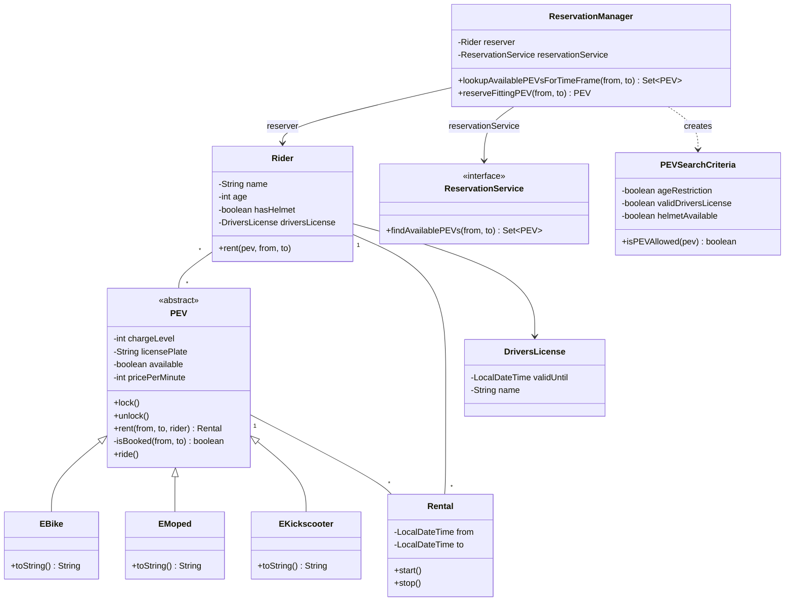
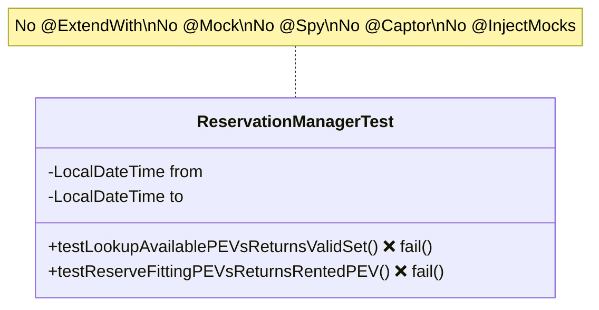
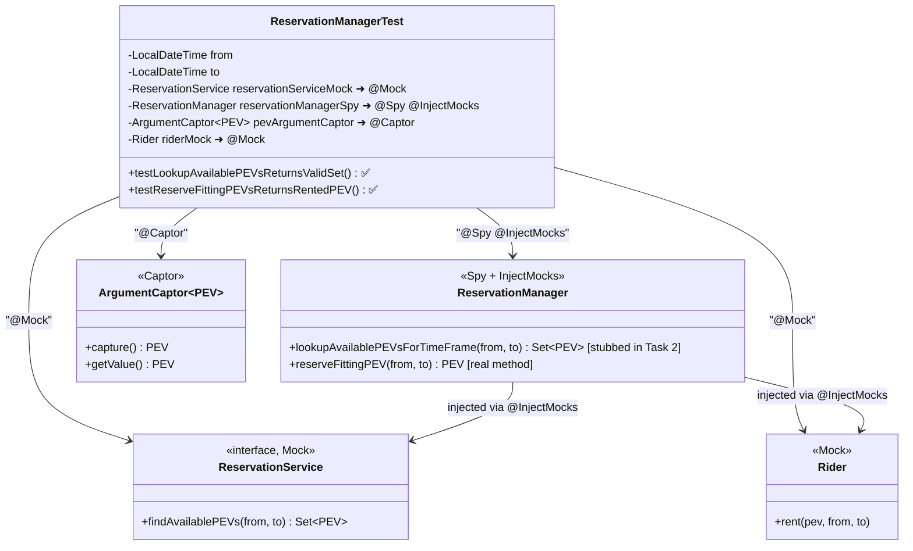
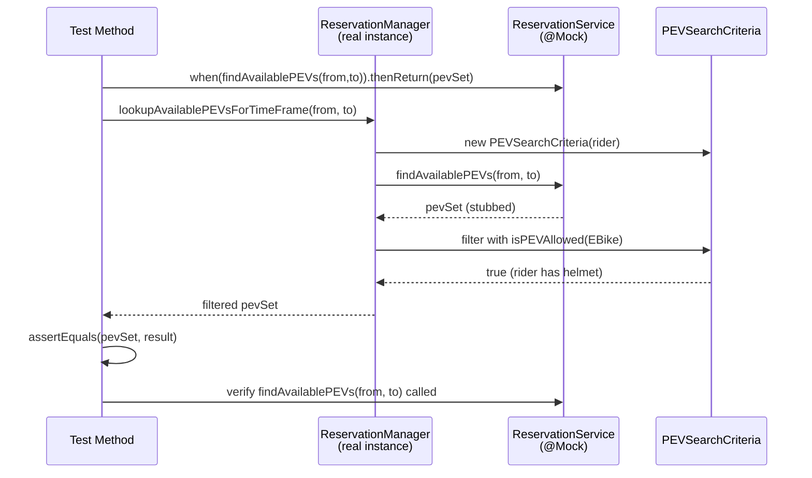
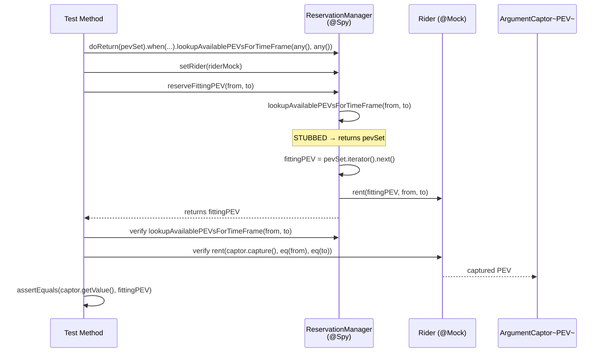

# Mock Object Pattern with Mockito — Solution Guide

## Overview

This exercise tests your ability to use **Mockito** with **JUnit 5** to write unit tests for `ReservationManager`. You must understand:

- **`@Mock`** — creates a mock (fake) instance of a class/interface
- **`@Spy`** — wraps a real object, allowing you to stub *specific* methods while keeping real behavior for others
- **`@InjectMocks`** — automatically injects `@Mock`/`@Spy` dependencies into the target object's constructor
- **`@Captor`** — declares an `ArgumentCaptor` to capture arguments passed to mocked method calls
- **`@ExtendWith(MockitoExtension.class)`** — activates Mockito annotations in JUnit 5

---

## Domain UML Class Diagram



---

## Test Architecture UML — Before (Template)

In the template, the test class has **no mocks, no spies, no captors** — just two failing stubs:



---

## Test Architecture UML — After (Solution)

After completing the tasks, the test class uses Mockito annotations to wire up mocks, spies, and captors:



### How the wiring works

```
@InjectMocks picks the constructor:
    ReservationManager(Rider reserver, ReservationService reservationService)

Mockito matches:
    reserver           ← @Mock Rider riderMock
    reservationService ← @Mock ReservationService reservationServiceMock

Then @Spy wraps the constructed ReservationManager in a spy.
```

---

## Task 1 Interaction Diagram



## Task 2 Interaction Diagram



---

## Key Classes to Understand

### `ReservationManager` (the SUT — System Under Test)

```java
public class ReservationManager {
    private Rider reserver;
    private ReservationService reservationService;

    // Constructor takes Rider + ReservationService
    public ReservationManager(Rider reserver, ReservationService reservationService) { ... }

    // Delegates to reservationService.findAvailablePEVs(), then filters by rider criteria
    public Set<PEV> lookupAvailablePEVsForTimeFrame(LocalDateTime from, LocalDateTime to) {
        PEVSearchCriteria pevSearchCriteria = new PEVSearchCriteria(this.reserver);
        Set<PEV> availablePEVs = this.reservationService.findAvailablePEVs(from, to);
        return availablePEVs.stream().filter(pevSearchCriteria::isPEVAllowed).collect(Collectors.toSet());
    }

    // Calls lookupAvailablePEVsForTimeFrame(), picks the first PEV, calls reserver.rent()
    public PEV reserveFittingPEV(LocalDateTime from, LocalDateTime to) {
        Set<PEV> foundPEVs = lookupAvailablePEVsForTimeFrame(from, to);
        if (foundPEVs.isEmpty()) { throw new NoPEVAvailableException(); }
        PEV fittingPEV = foundPEVs.iterator().next();
        reserver.rent(fittingPEV, from, to);
        return fittingPEV;
    }
}
```

### `ReservationService` (interface — must be mocked)

```java
public interface ReservationService {
    Set<PEV> findAvailablePEVs(LocalDateTime from, LocalDateTime to);
}
```

### `PEVSearchCriteria` (filters PEVs based on rider attributes)

- `EBike` → rider needs a helmet (`hasHelmet == true`)
- `EKickscooter` → rider needs age ≥ 16 AND helmet
- `EMoped` → rider needs a valid driver's license

---

## Template (Before)

The starting test file contained only empty test stubs with `fail()`:

```java
package de.tum.cit.aet.pse;

import org.junit.jupiter.api.*;
import org.mockito.*;

import java.time.LocalDateTime;

import static org.junit.jupiter.api.Assertions.*;
import static org.mockito.Mockito.*;

/*
 * TODO:
 *  To use Mockito in your tests, use @ExtendWith
 *  with the MockitoExtension class.
 */
class ReservationManagerTest {

    private final LocalDateTime from = LocalDateTime.of(2020, 10, 10, 10, 10);
    private final LocalDateTime to = LocalDateTime.of(2020, 10, 10, 10, 11);

    /*
     * TODO:
     *  1. Declare a Rider and ReservationService Mock ...
     *  2. Inject the Mocks into the SUT ...
     *  3. Implement the test ...
     */
    @Test
    void testLookupAvailablePEVsReturnsValidSet() {
        fail();
    }

    /*
     * TODO:
     *  1. Use the ReservationManager and stub the implementation ...
     *  2. Declare a PEV ArgumentCaptor ...
     *  3. Implement the test ...
     */
    @Test
    void testReserveFittingPEVsReturnsRentedPEV() {
        fail();
    }
}
```

---

## Task 1: `testLookupAvailablePEVsReturnsValidSet`

### Goal

Verify that `lookupAvailablePEVsForTimeFrame(from, to)` correctly delegates to `ReservationService.findAvailablePEVs(from, to)` and returns the expected set of PEVs.

### Key Concepts Used

| Concept | Why |
|---|---|
| `@Mock ReservationService` | We don't have a real implementation of this interface |
| `@ExtendWith(MockitoExtension.class)` | Activates `@Mock`, `@Spy`, `@InjectMocks`, `@Captor` annotations |
| `when(...).thenReturn(...)` | Stub the mock to return our expected PEV set |
| `verify(mock).method(args)` | Confirm `findAvailablePEVs` was actually called with the right args |
| Real `Rider` with helmet | `PEVSearchCriteria` runs on the real rider — an EBike requires `hasHelmet == true` |

### Why a Real Rider (not the `@Mock Rider`)?

`lookupAvailablePEVsForTimeFrame` creates a `PEVSearchCriteria(this.reserver)` internally. `PEVSearchCriteria`'s constructor calls `rider.getAge()`, `rider.getDriversLicense()`, and `rider.hasHelmet()`. If the rider is a mock, all these return defaults (`0`, `null`, `false`), causing the filter to reject all PEVs — the returned set would be empty and the test would fail. So we need a **real Rider** with appropriate values (helmet = true, valid license, age ≥ 16) for the EBike to pass the filter.

### Solution Diff

```diff
  // At class level — add imports and annotation:
+ import org.junit.jupiter.api.extension.ExtendWith;
+ import org.mockito.junit.jupiter.MockitoExtension;
+ import java.util.HashSet;
+ import java.util.Set;

+ @ExtendWith(MockitoExtension.class)
  class ReservationManagerTest {

      // Add mock field for ReservationService:
+     @Mock
+     private ReservationService reservationServiceMock;

      @Test
      void testLookupAvailablePEVsReturnsValidSet() {
-         fail();
+         // 1. Create a REAL Rider with helmet (needed for PEVSearchCriteria filter)
+         DriversLicense license = new DriversLicense(LocalDateTime.MAX, "ABC");
+         Rider rider = new Rider("Caio", 27, true, license);
+
+         // 2. Create a ReservationManager with the real rider and mocked service
+         ReservationManager reservationManager = new ReservationManager(rider, reservationServiceMock);
+
+         // 3. Prepare expected PEV set (EBike — requires helmet, which rider has)
+         PEV pev = new EBike(80, "MUC");
+         Set<PEV> pevSet = new HashSet<>();
+         pevSet.add(pev);
+
+         // 4. Stub: when findAvailablePEVs is called with (from, to), return pevSet
+         when(reservationServiceMock.findAvailablePEVs(from, to)).thenReturn(pevSet);
+
+         // 5. Act: call the method under test
+         Set<PEV> aSet = reservationManager.lookupAvailablePEVsForTimeFrame(from, to);
+
+         // 6. Assert: returned set equals the expected set
+         assertEquals(pevSet, aSet);
+
+         // 7. Verify: findAvailablePEVs was called with the exact same arguments
+         verify(reservationServiceMock).findAvailablePEVs(from, to);
      }
```

### Explanation Step by Step

1. **Create real Rider** with `hasHelmet = true`, age 27, valid license → ensures `PEVSearchCriteria.isPEVAllowed(EBike)` returns `true`.
2. **Create `ReservationManager`** with the real rider and the `@Mock` ReservationService.
3. **Prepare a Set** containing one `EBike`.
4. **`when(...).thenReturn(...)`** — when the mock's `findAvailablePEVs(from, to)` is called, return our prepared set.
5. **Call the SUT** — `lookupAvailablePEVsForTimeFrame(from, to)`.
6. **`assertEquals`** — the returned set should match (after filtering, the EBike passes because rider has a helmet).
7. **`verify`** — confirms `findAvailablePEVs` was actually invoked with `from` and `to`.

---

## Task 2: `testReserveFittingPEVsReturnsRentedPEV`

### Goal

Verify that `reserveFittingPEV(from, to)`:
1. Calls `lookupAvailablePEVsForTimeFrame` to get available PEVs
2. Calls `reserver.rent(pev, from, to)` with one of those PEVs
3. Returns the same PEV that was rented

### Key Concepts Used

| Concept | Why |
|---|---|
| `@Spy` + `@InjectMocks` on `ReservationManager` | We need a **Spy** so we can stub `lookupAvailablePEVsForTimeFrame()` while keeping `reserveFittingPEV()` real |
| `@Mock Rider` | We need to verify that `rent()` is called on the rider |
| `doReturn(...).when(spy).method(...)` | Stub a spy's method (**must** use `doReturn` instead of `when` for spies!) |
| `any()` ArgumentMatcher | Accept any arguments when stubbing `lookupAvailablePEVsForTimeFrame` |
| `@Captor ArgumentCaptor<PEV>` | Capture the PEV argument passed to `rider.rent()` |
| `eq()` ArgumentMatcher | When mixing `capture()` with literal args, all args must use matchers |

### Why a Spy (not a Mock)?

- A **Mock** replaces *all* methods with stubs (they do nothing / return null).
- A **Spy** wraps a *real* object — all methods behave normally **unless** explicitly stubbed.
- We need `reserveFittingPEV()` to execute its **real** logic (calling `lookupAvailablePEVsForTimeFrame`, picking a PEV, calling `reserver.rent()`).
- But we want to **stub** `lookupAvailablePEVsForTimeFrame()` because "its implementation changes all the time."

### Why `doReturn` instead of `when().thenReturn()`?

For spies, `when(spy.method()).thenReturn(...)` actually **calls the real method** first, which may cause side effects or exceptions. `doReturn(...).when(spy).method(...)` avoids calling the real method.

### Solution Diff

```diff
  // At class level — add fields:
+     @Spy
+     @InjectMocks
+     private ReservationManager reservationManagerSpy;
+
+     @Captor
+     private ArgumentCaptor<PEV> pevArgumentCaptor;
+
+     @Mock
+     private Rider riderMock;

      @Test
      void testReserveFittingPEVsReturnsRentedPEV() {
-         fail();
+         // 1. Create an arbitrary set of PEVs
+         PEV pev = new EBike(80, "MUC");
+         Set<PEV> pevSet = new HashSet<>();
+         pevSet.add(pev);
+
+         // 2. Stub lookupAvailablePEVsForTimeFrame on the SPY to return pevSet
+         //    for ANY arguments (using any() matchers)
+         doReturn(pevSet).when(reservationManagerSpy).lookupAvailablePEVsForTimeFrame(any(), any());
+
+         // 3. Set the rider mock into the spy (so rent() is called on the mock)
+         reservationManagerSpy.setRider(riderMock);
+
+         // 4. Act: call reserveFittingPEV — real method runs, but lookup is stubbed
+         PEV fittingPEV = reservationManagerSpy.reserveFittingPEV(from, to);
+
+         // 5. Verify lookupAvailablePEVsForTimeFrame was called with (from, to)
+         verify(reservationManagerSpy).lookupAvailablePEVsForTimeFrame(from, to);
+
+         // 6. Verify rent() was called on the rider mock,
+         //    capture the PEV argument with the ArgumentCaptor
+         //    Note: eq() is required for from/to because we use capture() for the PEV
+         verify(riderMock).rent(pevArgumentCaptor.capture(), eq(from), eq(to));
+
+         // 7. Assert: the captured PEV equals the returned PEV
+         assertEquals(pevArgumentCaptor.getValue(), fittingPEV);
      }
```

### Explanation Step by Step

1. **Prepare a PEV set** — we use `EBike(80, "MUC")` in a `HashSet`.
2. **`doReturn(pevSet).when(spy).lookupAvailablePEVsForTimeFrame(any(), any())`**
   - Stubs the spy so that `lookupAvailablePEVsForTimeFrame` returns our set regardless of arguments.
   - `any()` is an ArgumentMatcher that matches any `LocalDateTime`.
3. **`reservationManagerSpy.setRider(riderMock)`** — replaces the injected rider with our mock so we can verify `rent()` calls on it.
4. **Call `reserveFittingPEV(from, to)`** — the real implementation runs:
   - It calls `lookupAvailablePEVsForTimeFrame(from, to)` → returns our stubbed set
   - It picks the first PEV (`pev`)
   - It calls `reserver.rent(pev, from, to)` → calls the mock rider
   - It returns `pev`
5. **`verify(reservationManagerSpy).lookupAvailablePEVsForTimeFrame(from, to)`** — confirms the lookup was called with the correct dates.
6. **`verify(riderMock).rent(pevArgumentCaptor.capture(), eq(from), eq(to))`**
   - Confirms `rent()` was called on the rider mock.
   - `pevArgumentCaptor.capture()` captures the PEV argument.
   - **Important rule**: when using `capture()` (which is a matcher), **all** other arguments must also be matchers → hence `eq(from)` and `eq(to)` instead of bare `from` and `to`.
7. **`assertEquals(pevArgumentCaptor.getValue(), fittingPEV)`** — the PEV that was passed to `rent()` must be the same one returned by `reserveFittingPEV()`.

---

## Full Final Test File

```java
package de.tum.cit.aet.pse;

import org.junit.jupiter.api.*;
import org.junit.jupiter.api.extension.ExtendWith;
import org.mockito.*;
import org.mockito.junit.jupiter.MockitoExtension;

import java.time.LocalDateTime;
import java.util.HashSet;
import java.util.Set;

import static org.junit.jupiter.api.Assertions.*;
import static org.mockito.Mockito.*;

@ExtendWith(MockitoExtension.class)
class ReservationManagerTest {

    private final LocalDateTime from = LocalDateTime.of(2020, 10, 10, 10, 10);
    private final LocalDateTime to = LocalDateTime.of(2020, 10, 10, 10, 11);

    @Mock
    private ReservationService reservationServiceMock;

    @Spy
    @InjectMocks
    private ReservationManager reservationManagerSpy;

    @Captor
    private ArgumentCaptor<PEV> pevArgumentCaptor;

    @Mock
    private Rider riderMock;

    @Test
    void testLookupAvailablePEVsReturnsValidSet() {
        DriversLicense license = new DriversLicense(LocalDateTime.MAX, "ABC");
        Rider rider = new Rider("Caio", 27, true, license);
        ReservationManager reservationManager = new ReservationManager(rider, reservationServiceMock);

        PEV pev = new EBike(80, "MUC");
        Set<PEV> pevSet = new HashSet<>();
        pevSet.add(pev);
        when(reservationServiceMock.findAvailablePEVs(from, to)).thenReturn(pevSet);
        Set<PEV> aSet = reservationManager.lookupAvailablePEVsForTimeFrame(from, to);
        assertEquals(pevSet, aSet);
        verify(reservationServiceMock).findAvailablePEVs(from, to);
    }

    @Test
    void testReserveFittingPEVsReturnsRentedPEV() {
        PEV pev = new EBike(80, "MUC");
        Set<PEV> pevSet = new HashSet<>();
        pevSet.add(pev);
        doReturn(pevSet).when(reservationManagerSpy).lookupAvailablePEVsForTimeFrame(any(), any());
        reservationManagerSpy.setRider(riderMock);

        PEV fittingPEV = reservationManagerSpy.reserveFittingPEV(from, to);
        verify(reservationManagerSpy).lookupAvailablePEVsForTimeFrame(from, to);
        verify(riderMock).rent(pevArgumentCaptor.capture(), eq(from), eq(to));
        assertEquals(pevArgumentCaptor.getValue(), fittingPEV);
    }
}
```

---

## Summary of Mockito Annotations Used

| Annotation | Applied To | Purpose |
|---|---|---|
| `@ExtendWith(MockitoExtension.class)` | Test class | Enables Mockito annotations in JUnit 5 |
| `@Mock` | `ReservationService`, `Rider` | Creates mock instances (all methods return defaults) |
| `@Spy` | `ReservationManager` | Creates a spy (real methods run unless stubbed) |
| `@InjectMocks` | `ReservationManager` | Injects `@Mock`/`@Spy` fields into constructor |
| `@Captor` | `ArgumentCaptor<PEV>` | Declares a captor to grab method arguments during verification |

## Key Mockito Methods Used

| Method | Purpose |
|---|---|
| `when(mock.method()).thenReturn(value)` | Stub a mock to return a value |
| `doReturn(value).when(spy).method()` | Stub a spy (avoids calling real method) |
| `verify(mock).method(args)` | Assert that a method was called with specific args |
| `any()` | ArgumentMatcher — matches any value |
| `eq(value)` | ArgumentMatcher — matches a specific value (required when mixing with `capture()`) |
| `captor.capture()` | Captures the argument for later assertion |
| `captor.getValue()` | Retrieves the captured argument |
